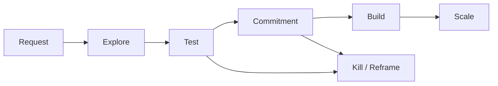

# Before Build

**Repository slug:** `before-build`

A lightweight, opinionated framework for validating business ideas, hypotheses, startup concepts, SaaS products, business plans, monetization models, and product or custom-development requests before investment, estimation, prototyping, and build.

  

Before Build is a universal evidence gate for any initiative that claims it can create value, demand, revenue, or a repeatable business. It helps prevent common mistakes: building from a feature request, treating interviews as demand, confusing a business plan with proof, ignoring existing alternatives, mistaking attention for willingness to pay, confusing operational access with willingness to pay, and turning a technical prototype into an unsolicited MVP.

[Discussions](https://github.com/Rommancen/before-build/discussions) · [Issues](https://github.com/Rommancen/before-build/issues) · [Latest release](https://github.com/Rommancen/before-build/releases/latest)

## Who it is for

Founders, startup teams, product managers, investors, consultants, agencies, and development teams that need to decide whether an idea, business hypothesis, SaaS concept, business plan, product request, pilot, or new revenue initiative deserves discovery, an experiment, investment, or a build.

This framework does not replace customer research, financial modeling, legal review, or technical due diligence. It provides the common first gate for all of them: distinguish an attractive story or interest in an idea from evidence that justifies spending, development, fundraising, or scale.

## What it validates

Before Build can be applied to:

- startup ideas and business hypotheses;
- SaaS, marketplace, platform, service, and digital-product concepts;
- business plans, investment theses, and new ventures;
- pricing, monetization, distribution, and go-to-market hypotheses;
- product requests, feature proposals, automation ideas, and custom-development projects;
- pilots, design partnerships, strategic partnerships, and new revenue channels;
- internal innovation initiatives and operational transformation proposals;
- any other claim that a defined customer, user, buyer, or payer will change behavior and create measurable economic value.

The name of the initiative does not change the standard. Every idea must first pass the same evidence-driven sequence before it receives material capital, production development, or permission to scale.

## Contents

- [`docs/decision_engine.json`](docs/decision_engine.json) — the canonical decision engine: evidence levels, gates, kill/reframe triggers, test selection, and allocation rules.
- [`docs/intake_checklist.md`](docs/intake_checklist.md) — a short mandatory triage for every new request.
- [`docs/intake_record_template.md`](docs/intake_record_template.md) — a reusable record for evidence, alternatives, commitment, and the decision.
- [`docs/example_intake_record.md`](docs/example_intake_record.md) — an anonymized example showing why a feature request leads to `TEST`, not `BUILD`.
- [`docs/use_case_record_template.en.md`](docs/use_case_record_template.en.md) — a privacy-safe template for recording what a real validation case taught.
- [`docs/project_decision_profile_template.json`](docs/project_decision_profile_template.json) — a project-specific configuration that does not replace or weaken the decision engine.
- [`docs/glossary.en.md`](docs/glossary.en.md) — concise definitions of the core decision-engine terms.
- [`docs/example_paid_pilot_intake_record.en.md`](docs/example_paid_pilot_intake_record.en.md) — an illustrative paid-pilot example with a limited `BUILD` authorization.

English documentation: [`intake checklist`](docs/intake_checklist.en.md) · [`intake record`](docs/intake_record_template.en.md) · [`example`](docs/example_intake_record.en.md) · [`use-case record`](docs/use_case_record_template.en.md) · [`glossary`](docs/glossary.en.md) · [`paid-pilot example`](docs/example_paid_pilot_intake_record.en.md)

## Quick start

1. Copy this repository for a new project.
2. Create an instance of `intake_record_template.md` for the first request.
3. Complete `intake_checklist.md` before estimation, architecture, or code.
4. Keep facts, assumptions, unknowns, and contradictory evidence separate.
5. Choose the cheapest test for the current riskiest assumption.
6. Do not start a commercial build before the applicable evidence gate — usually `E3` costly commitment.

Every decision must explicitly record a measurable outcome, one next action, a decision owner, and a review date. Urgency may change the test timeline, but it does not lower the evidence gate.

## Non-negotiable rules

> Problem before solution. Behavior before opinion. Costly commitment before commercial build. Capital follows evidence.

- `UNKNOWN` remains `UNKNOWN`.
- Several weak signals do not automatically become strong evidence.
- Market size, scorecards, technical feasibility, and sunk cost do not override the evidence gate.
- An existing alternative closes the request until a specific remaining gap is demonstrated.
- `PROCEED TO DISCOVERY` does not mean `BUILD AUTHORIZED`.
- Operational commitment does not prove willingness to pay.
- Urgency, deadlines, stakeholder pressure, and money already spent are not exceptions to the evidence gate.

## How to use and publish

This is an opinionated framework, not a ready-made application. Copy the repository, create a separate intake record for every idea or initiative, and adapt only project-specific gates that can be verified. Do not weaken the canonical `decision_engine.json` to justify a decision that has already been made.

Before publishing a copy, review its Git history: deleting a file from the current state does not remove its contents from history. Do not publish history containing client materials, personal data, secrets, or internal documents.

## License

Distributed under the [MIT License](LICENSE).

---

# Русская версия

Лёгкая, но строгая evidence-driven система проверки бизнес-гипотез до инвестиций, оценки, прототипирования и разработки.

Документация на английском: [`intake checklist`](docs/intake_checklist.en.md) · [`intake record`](docs/intake_record_template.en.md) · [`example`](docs/example_intake_record.en.md) · [`glossary`](docs/glossary.en.md) · [`paid-pilot example`](docs/example_paid_pilot_intake_record.en.md)

Проект предназначен для проверки любых идей, на которых предполагается создать ценность, спрос, выручку или повторяемую бизнес-модель: стартапов, SaaS-продуктов, новых сервисов и платформ, бизнес-планов, инвестиционных инициатив, гипотез монетизации, продаж и дистрибуции, пилотов, партнёрств, автоматизации и заказной разработки.

Он помогает не допускать типичных ошибок: строить по feature request, принимать красивый бизнес-план за доказательство, считать интервью спросом, путать интерес с готовностью платить, игнорировать готовые альтернативы, путать операционный доступ с willingness to pay и превращать технический prototype в незаказанный MVP.

### Универсальный принцип

Неважно, как называется инициатива — стартап, SaaS, бизнес-план, MVP, пилот, новый канал продаж, инвестиционная возможность, внутренняя инновация или запрос на разработку. Если она предполагает, что кто-то изменит поведение и заплатит за измеримый результат, она проходит один и тот же фильтр: сначала проблема и контекст, затем альтернативы и роли, потом поведенческое и экономическое evidence, и только после этого — ограниченный build и масштабирование.

## Для кого

Для founders, стартап-команд, product managers, инвесторов, консультантов, агентств и команд разработки, которым нужно решить, заслуживает ли бизнес-идея, гипотеза, SaaS-концепция, бизнес-план, пилот или запрос на разработку Discovery, эксперимента, инвестиций или build.

Проект не заменяет customer research, финансовую модель, юридическую экспертизу или технический due diligence. Он задаёт общий первый фильтр для всех этих работ: помогает не перепутать привлекательную историю, интерес или намерение с evidence, которое оправдывает затраты, разработку, привлечение капитала или масштабирование.

## Содержимое

- [`docs/decision_engine.json`](docs/decision_engine.json) — канонический decision engine: evidence levels, gates, kill/reframe triggers, правила выбора теста и allocation.
- [`docs/intake_checklist.md`](docs/intake_checklist.md) — короткий обязательный triage для каждого нового запроса.
- [`docs/intake_record_template.md`](docs/intake_record_template.md) — копируемая карточка для фиксации evidence, альтернатив, commitment и решения.
- [`docs/example_intake_record.md`](docs/example_intake_record.md) — короткий обезличенный пример: почему feature request приводит к `TEST`, а не к `BUILD`.
- [`docs/use_case_record_template.md`](docs/use_case_record_template.md) — шаблон безопасной фиксации результатов реального validation-case.
- [`docs/project_decision_profile_template.json`](docs/project_decision_profile_template.json) — копируемая настройка для конкретного проекта; не заменяет и не ослабляет decision engine.
- [`docs/quick_start.ru.md`](docs/quick_start.ru.md) — русская пошаговая инструкция для первого запуска.

## Быстрый старт

1. Скопируйте этот репозиторий для нового проекта.
2. Создайте экземпляр `intake_record_template.md` для первого запроса.
3. Пройдите `intake_checklist.md` до любой оценки, архитектуры или кода.
4. Храните факты, assumptions, unknowns и противоречащее evidence раздельно.
5. Выберите самый дешёвый тест для текущей riskiest assumption.
6. Не начинайте коммерческий build до применимого evidence gate — обычно `E3` costly commitment.

Перед любым решением должны быть явно записаны: измеримый outcome, один следующий шаг, владелец решения и дата пересмотра. Срочность запроса меняет срок теста, но не снижает evidence gate.

## Правила без исключений

- `UNKNOWN` остаётся `UNKNOWN`.
- Несколько слабых сигналов не становятся сильным evidence автоматически.
- Размер рынка, scorecard, техническая возможность и sunk cost не отменяют evidence gate.
- Готовая альтернатива закрывает запрос, пока не доказан конкретный остаточный дефицит.
- `PROCEED TO DISCOVERY` не означает `BUILD AUTHORIZED`.
- Операционный commitment не доказывает willingness to pay.
- Срочность, дедлайн, давление стейкхолдеров и уже потраченные деньги не являются исключением из evidence gate.

## Лицензия

Распространяется по лицензии [MIT](LICENSE).
